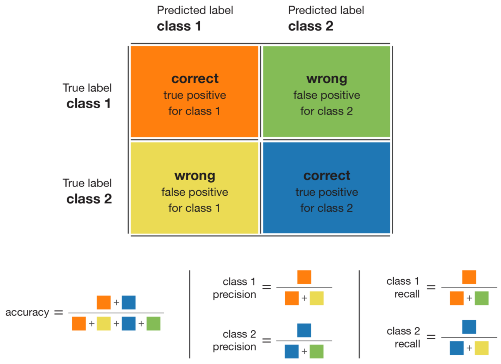

# Machine Learning - single-cell expression data classification
This project was realised in an attempt to improve the results of a Machine Learning competition for the course LINGI2262 at UCLouvain.
The competition consisted in training a model in order to 
* predict the label of unclassified data,
* estimate the model's performance. 

As preprocessing is a major part of a ML classification task, we spend the time to discuss and detail our different steps.

Here, we do not care about deploying the optained model (this could be an extension to this project).

## The dataset

The data we worked with is called [single-cell expression data](https://en.wikipedia.org/wiki/Single-cell_transcriptomics). 
The original dataset contains high dimensional (23000+ features), sparse, imbalanced (85% vs 15%) data, containing missing values (~ 5% overall distribution) and both numerical and categorical features.

For copyright reasons, the dataset itself will not be disclosed.

## The models

Different models were evaluated against each other
* Multi-Layer Perceptron (MLP)
* Random Forest (RF)
* Support Vector Machine (SVC)
* Ensemble classifiers (AdaBoost)
* Optimal tree learning (DL8.5) - WIP

In particular, DL8.5 was explored in an attempt to improve the classification score.
DL8.5 is an algorithm for finding optimal decision trees under constraints.
 > **[DL852020]** Aglin, G., Nijssen, S., Schaus, P. Learning optimal decision trees using caching branch-and-bound search. In AAAI. 2020. 

## Classification metric

The classification metric chosen for its robustness against imbalanced data is the balanced classification rate (BCR), known as `balanced_accuracy` in scikit-learn. This metric combines the sensitivity (or recall : ratio of the positive correctly classified samples to the total number of positive samples) and specificity (or inverse recall : ratio of the correctly classified negative samples to the total number of negative samples) metrics and it is calculated as follows, 
$BCR = \frac{1}{2} (TPR + TNR) = \frac{1}{2} (\frac{TP}{TP + FN} + \frac{TN}{TN + FP})$ .

Image taken from [towards data science](https://towardsdatascience.com/handling-imbalanced-datasets-in-machine-learning-7a0e84220f28) .

## Obtained results

`<`Work in progress`>`

## Further remarks

The code was made with the idea of being easily adaptable for various datasets.

## Disclaimer

This published code is not related to the LINGI2262 course, although the course's competition was an excuse to learn more about ML and get a firts hands-on experience. This repository should not be used as inspiration for the course's future competition (come one man, you should try this yourself 😉).
